--- 
title: Introduction
subtitle: Explore the APIs and test them live from the browser
---

This section provides a detailed guide for each of the APIs, with sample code and responses.

## Testing the APIs from the browser

The reference pages allow you to call the APIs directly from the browser. To get started:


1. Create a developer account on the [Staging]() or [Production]() consoles. Read more about the environments [here]().
1. Create an [API key]() from the `API keys` tab on the console, with the permissions required for the APIs you want to use.
1. From the page of your API of choice, insert the right API key in the authorization slot, introduce the different parameters, and call "Send".
1. (Optional) To call APIs in the production environment, find the API endpoint selector (⌄) next to the endpoint URL, and change it to `www.crossmint.com/api`.

The following guide will show you how to create a wallet and mint an NFT into it within 5 minutes. For this, make sure your API key has the scopes `wallets.create`, and `nfts.create`.

<AccordionGroup>
<Accordion title="Creating Wallets from the API Reference">
Follow the next steps to create a wallet within 5 minutes:

<Steps>
### Navigate to the Create Wallet page
<Frame>
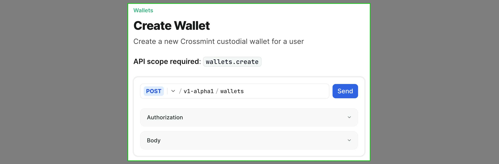
</Frame>
### Select the correct environment for the API key you created
<Frame>
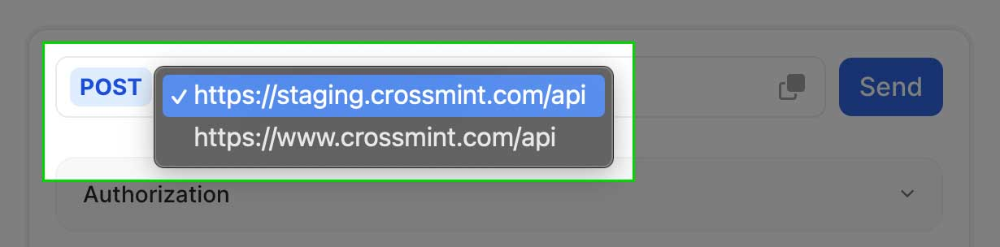
</Frame>
### Input your API key into the Authorization section
<Frame>
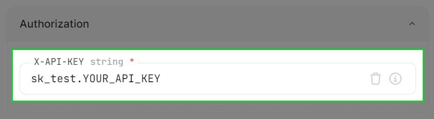
</Frame>
### Input the `body` parameters
You may add any additional properties. Each API reference page includes the full list of properties and admissible values.
<Frame>

</Frame>
### Send the request
Scroll back to the top of the page and click the blue `Send` button to trigger the API call.
<Frame>
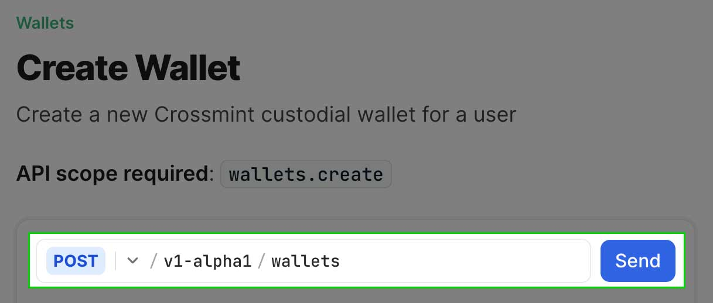
</Frame>
Here is an example response object:
<Frame>
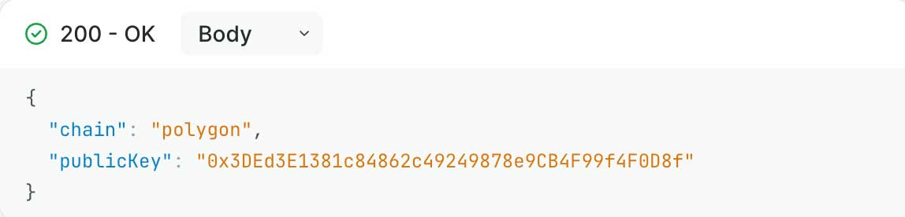
</Frame>
</Steps>
**Success!** The next guide will show you how to mint an NFT into this wallet and view the content.
</Accordion>
<Accordion title="Mint NFTs from the API Reference">
In the previous guide, you created a wallet. Now you will deliver an NFT into it and read the wallet’s content.

### Navigate to the Mint NFT page
Open in a new tab here: [/api-reference/minting/nfts/mint-nft](/api-reference/minting/nfts/mint-nft)
<Frame>
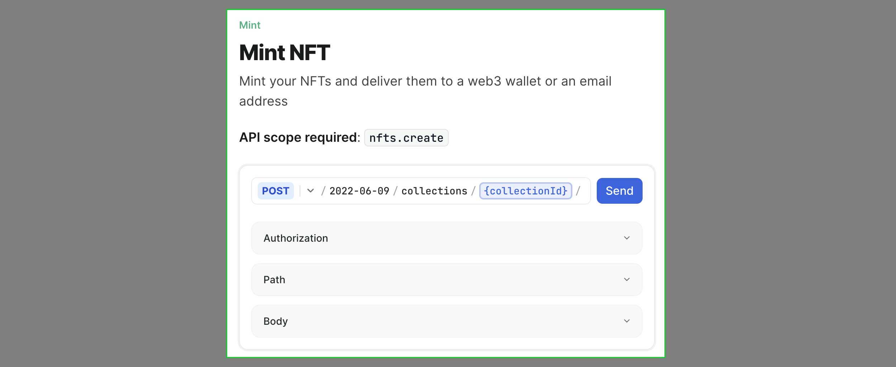
</Frame>
### Enter the `default-polygon` collectionId
This is a default collection associated to your account. You can create new ones using the [Create Collections]() API.
<Frame>
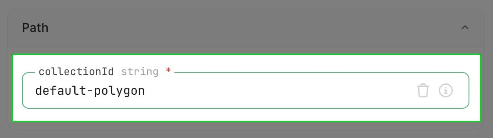
</Frame>
### Select the [EVM] Metadata URL metadata option
<Info>
The selector to choose between the different metadata option can be hard to spot. Look closely at the screenshots below to see where it is.
</Info>
<Frame>

</Frame>
<Frame>
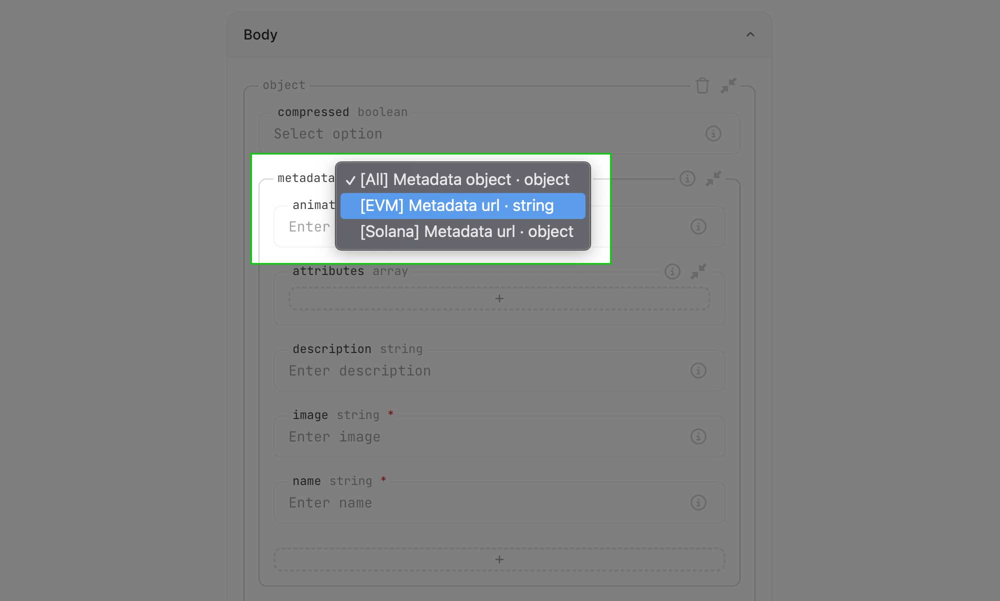
</Frame>
### Enter metadata URL
You can provide your own or use this example URL:
<CodeBlocks>
```js title="metadata URL"
https://bafkreidbf4jpxpecwezjbagwmua5qv62ifhhtzsspoml7zls6iq6ms4byi.ipfs.nftstorage.link/

```

```js title="example JSON"
{
  "name": "Crossmint Test NFT",
  "description": "Created with the Crossmint minting API",
  "image": "https://bafkreiexjl6kw4khdxkrt6dojgacscnzvrys47t472l2t7d6r2ss65kifq.ipfs.nftstorage.link/",
  "external_url": "https://docs.crossmint.com",
  "attributes":  [
    {
      "trait_type": "contract",
      "value": "ERC-721"
    },
    {
      "trait_type": "background",
      "value": "black"
    }
  ]
}

```
</CodeBlocks>
<Info>
This URL must point to a valid JSON file that adheres to [EVM metadata standards]().
</Info>
<Frame>
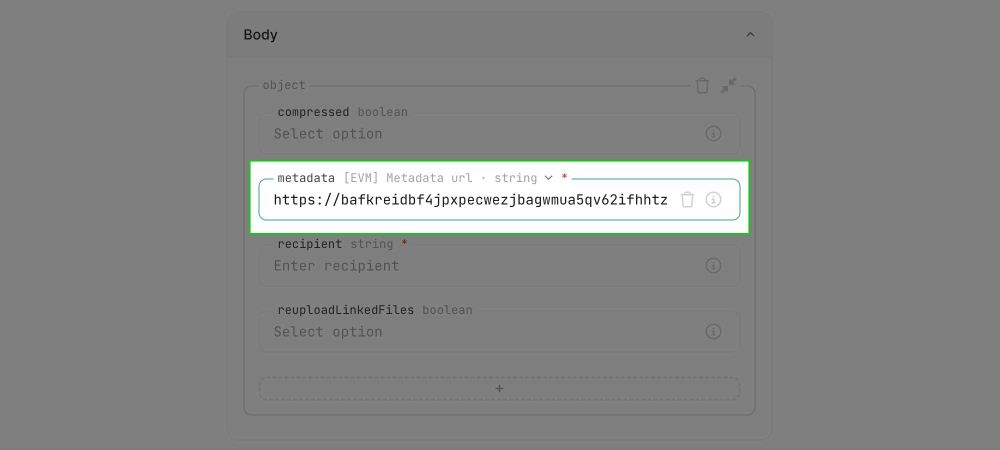
</Frame>
### Enter the `recipient`
There are two options for the `recipient` parameter. The first enables minting to an email address. The second enables minting directly to a wallet address.
<CodeBlocks>
```js title="email recipient"
  // format
  email:<email_address>:<chain>

  // example
  email:testy@crossmint.xyz:polygon
```

```js title="wallet recipient"
  // format
  <chain>:<address>

  // example
  polygon:0x0359Cd99FD20e853a85489DFC93EaDFeF7461590
```
</CodeBlocks>

<Check>
Enter your own email address on this step and you can login to see your NFT in the Crossmint wallet later, which can be accessed from [crossmint.com](crossmint.com) or [staging.crossmint.com](staging.crossmint.com) if you are in staging.
</Check>
<Frame>
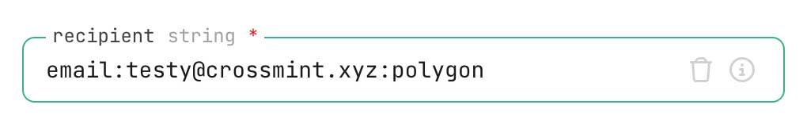
</Frame>
### Set `reuploadLinkedFiles` to false
This will prevent unnecessary uploading of files that are already pinned to IPFS.
<Check>
Crossmint has a 10MB re-upload size limit. For larger files, upload your media to IPFS, create a metadata.json as shown above, submit the metadata file’s URL, and ensure `reuploadLinkedFiles` is set to `false`.

The default option is `true`.
</Check>
<Frame>
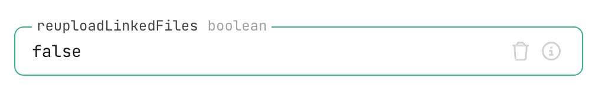
</Frame>
### Send the request
Scroll back to the top of the page and click the blue `Send` button to trigger the API call.
<Frame>
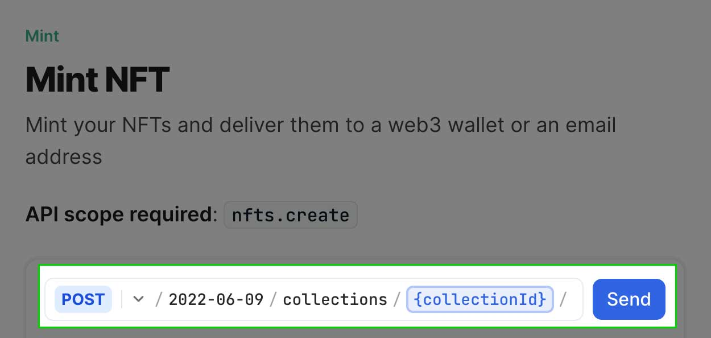
</Frame>
Here is an example response object:
<Frame>
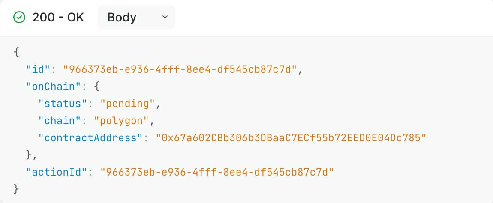
</Frame>
### View the NFT in your wallet
If you followed this guide closely you can view the NFT in the staging wallet at [https://staging.crossmint.com/user/collection](https://staging.crossmint.com/user/collection).

If you minted directly to a wallet address you can view the NFT in that application. Ensure you are accessing it from a testnet if you used staging.
</Accordion>
</AccordionGroup>

## Next Steps
Test any other API directly from the reference page. You can find more information about the products on the [documentation guides]().